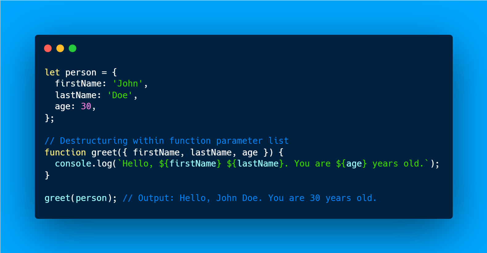
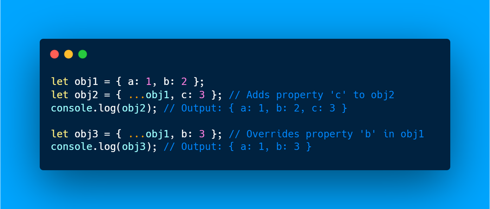

<h1 style="color: lightgreen"> What is Object in JS?

<h2> In JavaScript, an object is a fundamental data type that allows you to store collections of information. You can think of an object as a kind of container that holds properties and methods.

<h1 style="color: lightgreen"> Here's an example

.png>)

<!-- ------------------------------------------->

<h1 style="color: lightgreen"> Methods of Object in JS 

<h2> In JavaScript, methods are functions that are stored as properties of an object. These functions can be called to perform actions or computations related to the object. Here's how you can define methods in an object:

<h1 style="color: lightgreen">Object.entries()

<h2> The Object.entries() method in JavaScript returns an array of a given object's own enumerable string-keyed property [key, value] pairs, in the same order as that provided by a for...in loop. The order of the array returned by Object.entries() is consistent with the order provided by a for...in loop over the properties of the object.

# Here's an example with .entries() method .png>)

<h1 style="color: lightgreen">Object.keys()

<h2> 
The Object.keys() method in JavaScript returns an array of a given object's own enumerable property names.

# Here's an example with .keys() method .png>)

<h1 style="color: lightgreen">Object.values()

<h2> 

The Object.values() method in JavaScript returns an array of a given object's own enumerable property values.

# Here's an example with .values() method .png>)

<h1 style="color: lightgreen"> Destructuring in Object JS</h1>

## Destructuring in JavaScript allows you to extract multiple properties from an object or multiple elements from an array and assign them to variables in a concise way.

# Here's an example 

<h1 style="color: lightgreen"> Spread in Object JS</h1>

## In JavaScript, the spread syntax (...) can also be used with objects to create a shallow copy of an object, merge objects, or create new objects with additional properties.

# Here's an example 